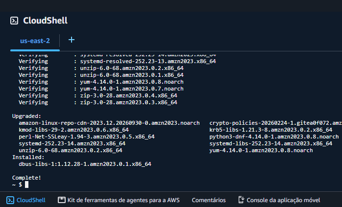
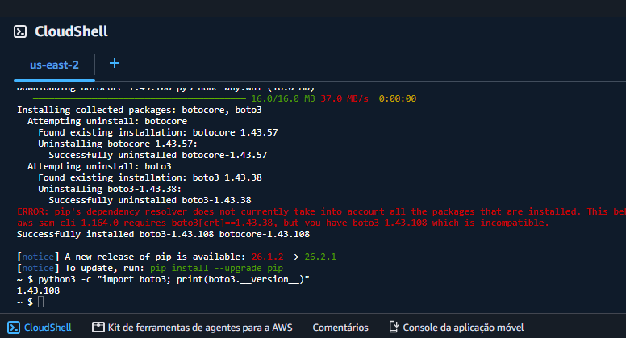
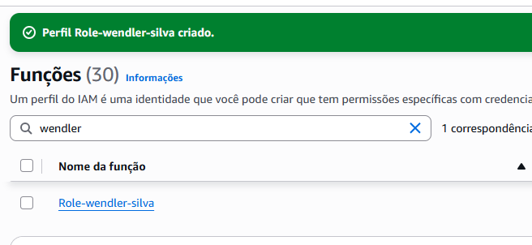
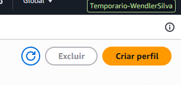
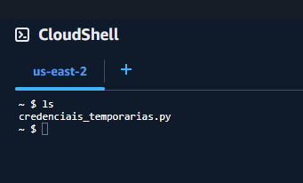
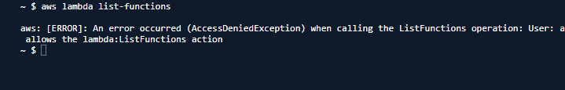

# 🔐 AWS STS — Credenciais Temporárias

## 📋 Visão Geral

Este laboratório demonstra o uso de **credenciais temporárias na AWS** utilizando o **AWS Security Token Service (STS)** e **IAM Roles**.

Durante o laboratório, foi criada uma IAM Role com permissões específicas, configurada sua política de confiança, realizada a troca para um perfil temporário e utilizadas credenciais temporárias para validar acessos permitidos e negados aos serviços AWS.

Também foi utilizado o **AWS CloudShell** para preparar um ambiente Python com **Boto3** e executar um script responsável pela obtenção das credenciais temporárias.

---

## 🎯 Objetivos

* Configurar o ambiente do AWS CloudShell para execução de scripts Python
* Instalar e utilizar o Boto3
* Criar uma IAM Role
* Configurar uma política de confiança
* Assumir uma IAM Role temporariamente
* Gerar credenciais temporárias utilizando o AWS STS
* Configurar as credenciais temporárias no AWS CLI
* Validar acessos permitidos e negados
* Compreender o funcionamento e a expiração de credenciais temporárias

---

## ☁️ Serviços AWS Utilizados

### AWS Security Token Service (STS)

O **AWS STS** permite solicitar credenciais de segurança temporárias para acessar recursos da AWS.

Neste laboratório, o STS foi utilizado para assumir uma IAM Role e gerar credenciais temporárias compostas por:

* AWS Access Key ID
* AWS Secret Access Key
* AWS Session Token

As credenciais possuem uma duração limitada e expiram após o período definido na sessão.

### IAM

O **AWS Identity and Access Management (IAM)** foi utilizado para criar a IAM Role, configurar sua política de confiança e definir as permissões disponíveis durante a sessão temporária.

### AWS CloudShell

O **AWS CloudShell** foi utilizado como ambiente de terminal para preparar o ambiente Python, instalar o Boto3 e executar o script utilizado no laboratório.

---

## 🛠️ Implementação

### 1. Configurar o ambiente Python

Primeiro, foi aberto o **AWS CloudShell**, que fornece um terminal integrado ao AWS Management Console.

O ambiente foi preparado para permitir a execução do script Python utilizado posteriormente para solicitar as credenciais temporárias através do AWS STS.

O Python foi instalado e sua versão foi verificada para confirmar que o ambiente estava preparado para a execução do laboratório.

---

### 2. Instalar o Boto3

Com o Python disponível, foi instalado o **Boto3**, SDK da AWS para Python.

O Boto3 permite que aplicações Python interajam com os serviços da AWS. Neste laboratório, ele foi utilizado pelo script responsável por solicitar as credenciais temporárias através do AWS STS.

Após a instalação, a versão do Boto3 foi verificada para confirmar que o ambiente estava configurado corretamente.

---

### 3. Criar a IAM Role

Com o ambiente preparado, foi criada uma **IAM Role** que será utilizada como uma identidade temporária.

A Role foi configurada para permitir que o usuário IAM utilizado no laboratório pudesse assumi-la.

Também foram definidas permissões para acesso ao **Amazon S3**, permitindo posteriormente validar na prática quais operações seriam autorizadas pela Role.

---

### 4. Configurar a política de confiança

Após criar a Role, foi configurada sua **política de confiança (Trust Policy)**.

Essa política define quais entidades possuem autorização para assumir a IAM Role. Neste laboratório, o usuário IAM utilizado no exercício foi definido como entidade confiável.

A configuração da política de confiança é diferente das permissões atribuídas à Role: enquanto a política de confiança determina **quem pode assumir a Role**, as políticas de permissões determinam **o que a Role pode fazer** depois de ser assumida.

Essa etapa foi realizada no AWS Management Console, sem a publicação de uma captura de tela, devido às informações de identificação presentes na configuração.

---

### 5. Assumir a Role temporariamente

Após a criação e configuração da Role, foi realizada a troca para o perfil temporário utilizando a opção **Alternar função (Switch Role)** no AWS Management Console.

Esse processo permite utilizar temporariamente a identidade e as permissões definidas pela IAM Role, sem alterar permanentemente as permissões do usuário IAM original.

O console passou a apresentar o contexto da Role assumida, permitindo validar que a troca de identidade havia sido realizada.

---

### 6. Gerar credenciais temporárias

Após preparar a Role, foi utilizado um script Python com **Boto3** para solicitar credenciais temporárias através do AWS STS.

Inicialmente, foi realizada uma tentativa utilizando uma duração superior ao limite configurado para a sessão. O objetivo foi observar o comportamento do STS quando a duração solicitada ultrapassa o limite permitido.

Em seguida, a duração foi ajustada para um valor válido e foram geradas as credenciais temporárias.

As credenciais retornadas pelo STS são compostas por:

* AWS Access Key ID
* AWS Secret Access Key
* AWS Session Token

> **Observação:** por questões de segurança, informações sensíveis presentes nas credenciais não foram disponibilizadas publicamente neste repositório.

---

### 7. Configurar e validar a identidade temporária

Com as credenciais temporárias configuradas no ambiente, foi realizada a validação da identidade utilizada pelo AWS CLI.

Essa etapa permitiu confirmar qual identidade estava sendo utilizada nas chamadas realizadas durante a sessão temporária.

Também foram realizados testes de acesso aos serviços AWS. O acesso ao **Amazon S3** foi permitido de acordo com as permissões atribuídas à Role, enquanto uma tentativa de acesso ao **AWS Lambda** resultou em acesso negado.

---

### 8. Validar a expiração das credenciais

As credenciais utilizadas durante o laboratório possuem duração limitada.

Após o período definido para a sessão, foi realizada uma nova tentativa de acesso aos recursos AWS. Como esperado, as credenciais temporárias expiradas deixaram de ser válidas.

Essa etapa permitiu observar na prática uma das principais características do AWS STS: as credenciais possuem validade limitada e não permanecem disponíveis indefinidamente.

A validação foi realizada no CloudShell e não teve uma captura publicada devido à presença de informações relacionadas à conta.

---

### 9. Restaurar as credenciais originais

Após concluir os testes, as credenciais temporárias foram removidas da configuração do AWS CLI.

O ambiente foi restaurado para que as chamadas seguintes voltassem a utilizar a identidade original do usuário IAM.

Essa etapa também evita manter informações relacionadas às credenciais temporárias no ambiente após a conclusão do laboratório.

---

### 10. Testar a política de confiança

Por fim, foi realizado um teste modificando a **política de confiança** da IAM Role.

A configuração original permitia que o usuário IAM utilizado no laboratório assumisse a Role. A política foi então alterada para utilizar outra entidade como principal confiável.

Após essa alteração, uma nova tentativa de assumir a Role foi realizada.

Como o usuário original deixou de fazer parte das entidades autorizadas pela política de confiança, a tentativa de assumir a Role foi negada.

Essa etapa demonstrou na prática a importância da **Trust Policy** no processo de autorização para assumir uma IAM Role.

---

## 🔍 Validação de Acesso

Durante o laboratório, foram realizados testes para validar o comportamento das credenciais temporárias e das permissões associadas à IAM Role.

O **Amazon S3** pôde ser acessado através da identidade temporária, enquanto o acesso ao **AWS Lambda** foi negado por não fazer parte das permissões atribuídas à Role.

Também foi validada a expiração das credenciais temporárias e o comportamento da IAM Role após a alteração de sua política de confiança.

---

## 🧠 Principais Aprendizados

Este laboratório permitiu compreender na prática o funcionamento de **IAM Roles**, **AWS STS** e **credenciais temporárias**.

Foi possível observar a diferença entre uma **política de confiança**, responsável por determinar quem pode assumir uma Role, e uma **política de permissões**, responsável por definir quais ações podem ser realizadas após a Role ser assumida.

Também foi possível compreender que as credenciais temporárias utilizam **AWS Access Key ID, AWS Secret Access Key e AWS Session Token**, possuem duração limitada e deixam de ser válidas após sua expiração.

Por fim, os testes demonstraram como uma IAM Role pode fornecer acesso controlado a determinados serviços AWS, permitindo uma aplicação mais restritiva das permissões.
